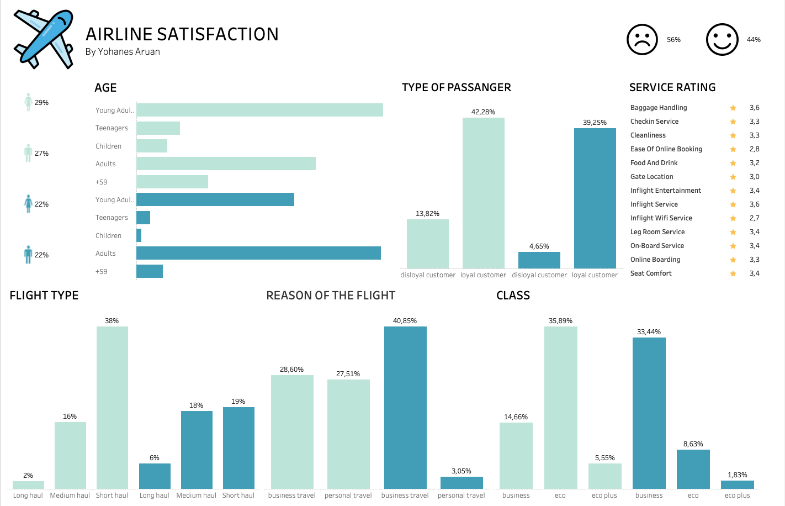

# ✈️ Airline Passenger Satisfaction Analysis  
🚀 **Analisis Data untuk Meningkatkan Pengalaman Penumpang Maskapai**  

## 📌 Project Overview  

Bagaimana kepuasan penumpang maskapai dapat ditingkatkan? Proyek ini melakukan **analisis data penerbangan** untuk mengidentifikasi **faktor utama yang memengaruhi kepuasan pelanggan**, menggunakan metode **data analytics & business intelligence**.  

🔍 **Apa yang bisa dipelajari?**  
✅ Menggunakan **data analytics** untuk memahami kepuasan pelanggan  
✅ Menerapkan **machine learning** untuk mengidentifikasi pola kepuasan  
✅ Memanfaatkan **business intelligence tools** untuk pengambilan keputusan  

---

## 📊 **Dataset**  

Dataset ini berisi **25,976 data penumpang maskapai** dengan berbagai atribut layanan dan informasi demografis.  

📌 **Fitur dalam dataset** meliputi:  
- 🆔 **id** – Identifikasi unik penumpang  
- 👤 **gender** – Jenis kelamin penumpang  
- 🎟️ **customer type** – Jenis pelanggan (Loyal atau Disloyal)  
- ✈️ **type of travel** – Jenis perjalanan (Bisnis atau Pribadi)  
- 🏆 **class** – Kelas layanan (Ekonomi, Bisnis, First Class)  
- 📡 **inflight wifi service** – Rating layanan WiFi di pesawat  
- 🍽️ **food and drink** – Penilaian makanan & minuman di pesawat  
- 💺 **seat comfort** – Kenyamanan tempat duduk  
- 🎬 **inflight entertainment** – Hiburan selama penerbangan  
- 🧹 **cleanliness** – Kebersihan pesawat  
- ⏳ **departure/arrival delay** – Keterlambatan keberangkatan & kedatangan  
- ⭐ **satisfaction** – Tingkat kepuasan (Satisfied atau Neutral/Dissatisfied)  

---

## 🔎 **Key Insights**  

📊 **Tingkat Kepuasan**  
✅ **43.9%** penumpang merasa puas  
❌ **56.1%** penumpang netral atau tidak puas  

💡 **Faktor Utama yang Mempengaruhi Kepuasan**:  
🔥 **Online Boarding** → Faktor paling berpengaruh terhadap kepuasan  
🎬 **Inflight Entertainment** → Kontribusi besar terhadap pengalaman pelanggan  
💺 **Seat Comfort** → Pengaruh moderat terhadap kepuasan pelanggan  
📡 **Inflight Wifi** → Pengaruh moderat terhadap pengalaman penumpang  

📊 **Analisis Berdasarkan Kelas Penerbangan**:  
🏆 **First Class** → Paling tinggi tingkat kepuasannya  
💼 **Business Class** → Kepuasan moderat  
🛫 **Economy Class** → Kepuasan terendah (perlu peningkatan layanan!)  

---

## 💼 **Business Intelligence Recommendations**  

📈 **Bagaimana Maskapai Bisa Meningkatkan Layanan?**  

✅ **Tingkatkan Pengalaman Online Boarding**  
   ➝ Buat proses boarding lebih cepat & efisien untuk meningkatkan kenyamanan pelanggan.  

✅ **Upgrade Inflight Entertainment**  
   ➝ Tambahkan lebih banyak pilihan hiburan untuk semua penumpang.  

✅ **Perbaiki Kenyamanan Kursi, Terutama di Kelas Ekonomi**  
   ➝ Investasi dalam kursi ergonomis untuk meningkatkan pengalaman pelanggan.  

✅ **Perbaiki Layanan WiFi di Pesawat**  
   ➝ Tingkatkan stabilitas dan kecepatan internet agar tetap terhubung di udara.  

✅ **Fokus pada Pelanggan Loyal**  
   ➝ Buat **loyalty program** untuk meningkatkan retensi pelanggan.  

✅ **Perbaiki Kualitas Makanan & Minuman**  
   ➝ Sediakan lebih banyak pilihan menu dan tingkatkan kualitas hidangan.  

📌 **Kesimpulan**: Dengan pendekatan berbasis **data analytics & business intelligence**, maskapai dapat meningkatkan pengalaman pelanggan secara signifikan!  

---

## 📊 **Dashboard Visualization**  

🎯 **Lihat hasil analisis dalam bentuk dashboard interaktif!**  
 
🔗 **[Dashboard Tableau](https://public.tableau.com/app/profile/yohanes.raditya.wirawan.aruan/viz/AirlineSatisfaction_17375339929560/Dashboard1)**  

---

## 🛠️ **How to Run the Project**  

1️⃣ **Clone Repository Ini**  
   ```bash
   git clone https://github.com/yourusername/airline-passenger-satisfaction.git
   cd airline-passenger-satisfaction
